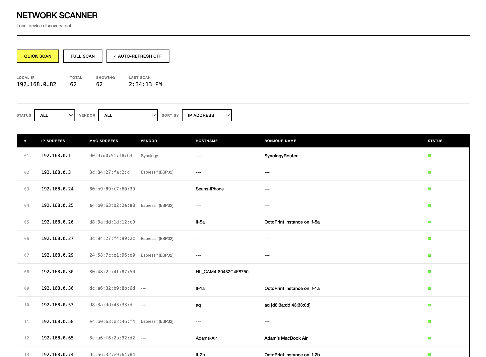

# Network Scanner

A beautiful network device discovery tool with a Swiss/Teenage Engineering aesthetic, designed for macOS.



## Features

- Quick scan using ARP table
- Full network scan with ping sweep
- Vendor/manufacturer detection via MAC address lookup
- Bonjour/mDNS device name discovery
- SSDP/UPnP device discovery
- Filters by status and vendor
- Sortable columns (IP, MAC, Vendor, Hostname)
- Click-to-copy IP and MAC addresses
- Auto-refresh at configurable intervals (10s, 30s, 1m, 5m)
- Clean monochrome UI with yellow accents
- Real-time device discovery
- Security-hardened backend

## Installation

1. Install Node.js dependencies:
```bash
npm install
```

## Running the App

### Development Mode
```bash
npm start
```

Then open your browser to: http://localhost:3001

### Packaged App
Double-click the `Network Scanner.app` in the `dist` folder to launch the standalone application.

## Usage

### Quick Scan (Recommended)
- Click "Quick Scan" to instantly see devices already in your ARP cache
- This is fast and shows devices you've recently communicated with

### Full Scan
- Click "Full Scan" to ping all IPs in your subnet (192.168.x.0/24)
- This takes longer but discovers all active devices
- The scan will ping up to 254 addresses and update the ARP table

### Filters and Sorting
- Use the STATUS dropdown to filter by online/offline/unknown
- Use the VENDOR dropdown to filter by manufacturer
- Use the SORT BY dropdown to sort by IP Address, MAC Address, Vendor, or Hostname

### Auto-Refresh
- Toggle "Auto-Refresh" to automatically run quick scans at regular intervals
- Select your preferred interval: 10s, 30s, 1m, or 5m
- Useful for monitoring network changes in real-time

### Click-to-Copy
- Click any IP address or MAC address to copy it to your clipboard
- A "Copied!" tooltip confirms the action

## Creating a macOS App Bundle

To package this as a standalone macOS application:

```bash
npm run package
```

This creates `Network Scanner.app` in the `dist` folder using Electron.

## How It Works

1. **Backend (Node.js/Express)**
   - Scans the local network using system commands
   - Reads the ARP table for MAC addresses
   - Performs ping sweeps for full network discovery
   - Resolves hostnames and Bonjour names
   - Discovers UPnP devices via SSDP
   - Provides REST API endpoints
   - Security-hardened with input validation and resource limits

2. **Frontend (React 18)**
   - Swiss/Teenage Engineering inspired design
   - Monochrome with yellow accent color
   - Real-time updates
   - Tabular list view with filters and sorting
   - Click-to-copy functionality
   - Auto-refresh capabilities

## Security Features

**Version 1.1.0** includes comprehensive security hardening:

- **Input Validation**: All IP addresses validated before use in shell commands to prevent command injection
- **Batch Processing**: Network scans limited to 20 concurrent operations to prevent resource exhaustion
- **Memory Management**: Device caches with TTL (5 minute expiration) and periodic cleanup
- **Race Condition Prevention**: Proper async/await handling and single-operation guards

## Security Notes

- This app requires network access permissions
- On macOS, you may need to grant Terminal or the app network privileges
- The app only scans your local subnet (192.168.x.x or similar)
- No data is sent outside your local network

## Troubleshooting

**Port already in use:**
- Change the PORT in `server.js` (default: 3001)

**Permission errors:**
- Some network scanning features may require elevated privileges
- Run with `sudo` if needed (not recommended for production)

**Can't find devices:**
- Make sure you're on the same network
- Try the Full Scan option
- Check your firewall settings

**Multiple instances launching:**
- The app includes single-instance lock to prevent this
- If it occurs, force quit all instances and relaunch

## Technical Stack

- **Backend**: Node.js, Express
- **Frontend**: React 18, Vanilla CSS
- **Network Tools**: ARP, Ping, Bonjour/mDNS, SSDP
- **Packaging**: Electron 27

## Version History

- **v1.1.0** (2025-10-31): Security hardening - command injection prevention, batch processing, memory leak fixes, race condition fixes
- **v1.0.0** (2025-10-31): Initial release with Swiss/TE design, vendor detection, filters, click-to-copy, auto-refresh

## License

MIT
